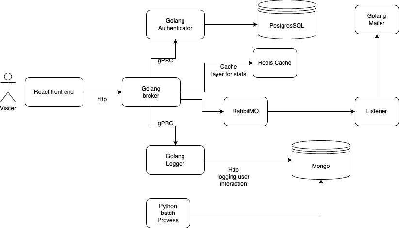

# Go-micro-practice

Practicing micro service architecture in golang, python, and reactjs.


# architecture




# Gun

Project folder is the entry point
```
cd project
```

## Docker 
Instead of two stage building strategy, I choose to compile the golang into linux binary App first, and mount to a simple Alpine linux image.
Use following make command for simplicity


## make command


> For build all the binary and docker-compose up --build
```
make up_build 
```
> Back ground docker compose up
``` 
make up
```
> Docker compose down
```
make down
```
--------


Micro-serive in kubernetes is usually used in a bigger project. Except for the overkilling tools and unesscerily complex structure.
There is still some points to avoid in production
- k8s including persisting app: for the transient nature of a k8s pod, the better practice might be using a external database service rather then hosting a mongo image in a k8s pod, same as MQ service like RabbitMQ, and SQL database like Postgres.
- for better performance, the internal services cound all use rpc.


